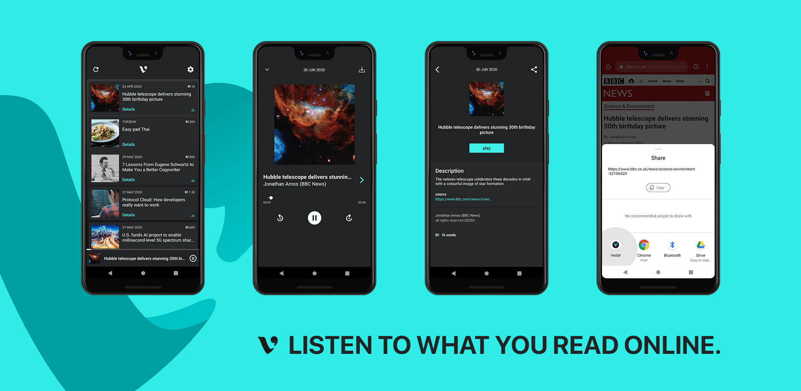
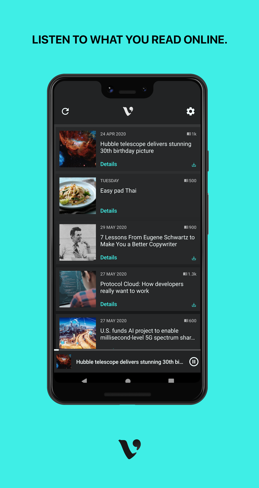
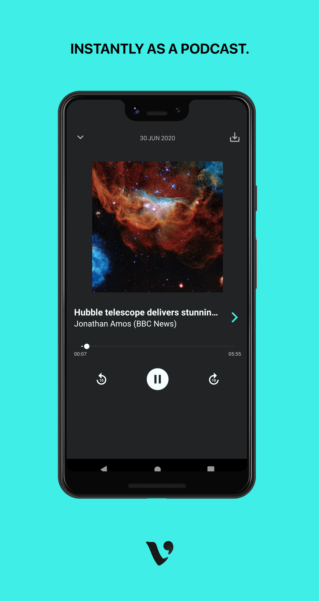
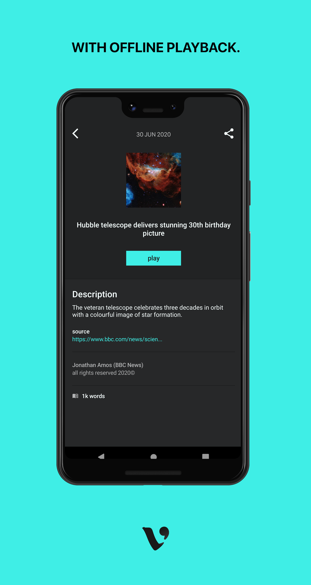
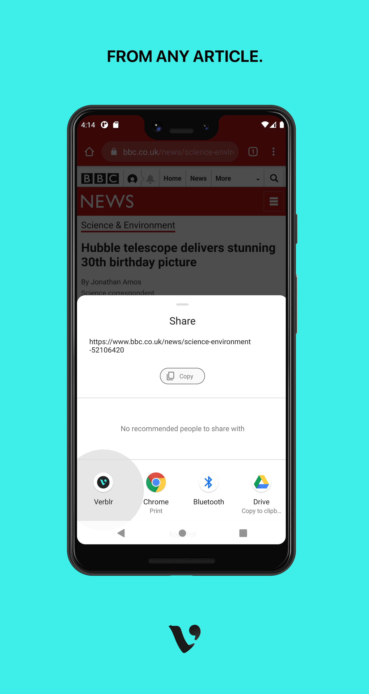

# Overview 
Source code for the [Verblr](https://verblr.com) Android app. 

A first go at a pure Kotlin implementation, with UI built on constraint based layout and reactive view models.

## Features

## License
Please see [here](https://choosealicense.com/no-permission/).